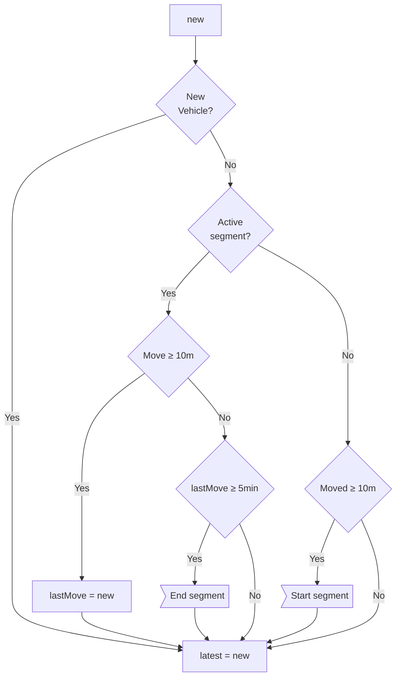

# trip-processor

We're relying on location to detect motion because all high-frequency sources have it. AutoPi support for odometer, speed, or runtime appears spotty.

```mermaid
flowchart TD
  new --> C1{New\nVehicle?}
  C1 -->|Yes| FU[latest = new]
  C1 -->|No| S2{Active\nsegment?}

  S2 -->|Yes| S3{"Move ≥ 10m"}
  S2 -->|No| S7{"Moved ≥ 10m"}


  S4 -->|Yes| S5>"End segment"]
  S3 -->|Yes| S6["lastMove = new"]
  S3 -->|No| S4{"lastMove ≥ 5min"}
  S4 -->|No| FU


  S6 --> FU
  S5 --> FU
  S7 -->|Yes| S8>"Start segment"]
  S7 -->|No| FU
  S8 --> FU
```
