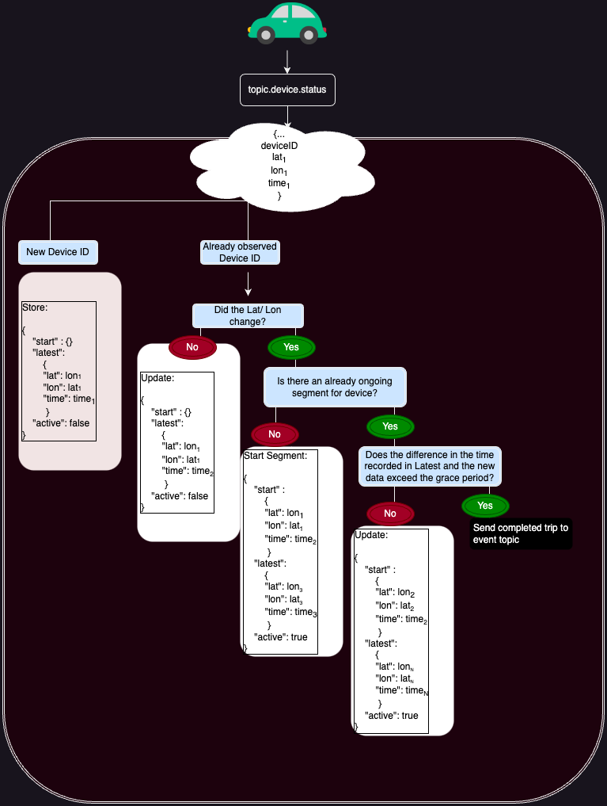
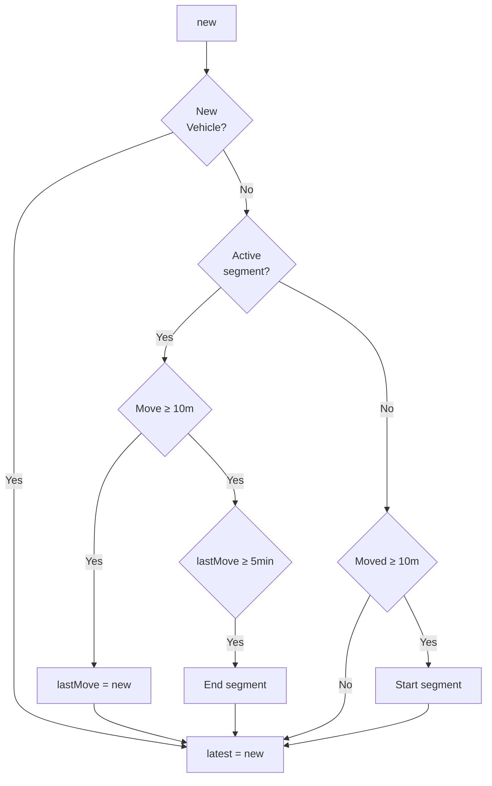

# DIMO Trips API

AutoPis often transmit engine start (`vehicle/engine/running`) and stop (`vehicle/engine/stopped`) events. I've heard these are unreliable.

From Teslas, we get a rich data point roughly every minute that the car is online. The plan is to do some simple [session windowing](https://developer.confluent.io/tutorials/create-session-windows/confluent.html) on data points with non-zero speed.

